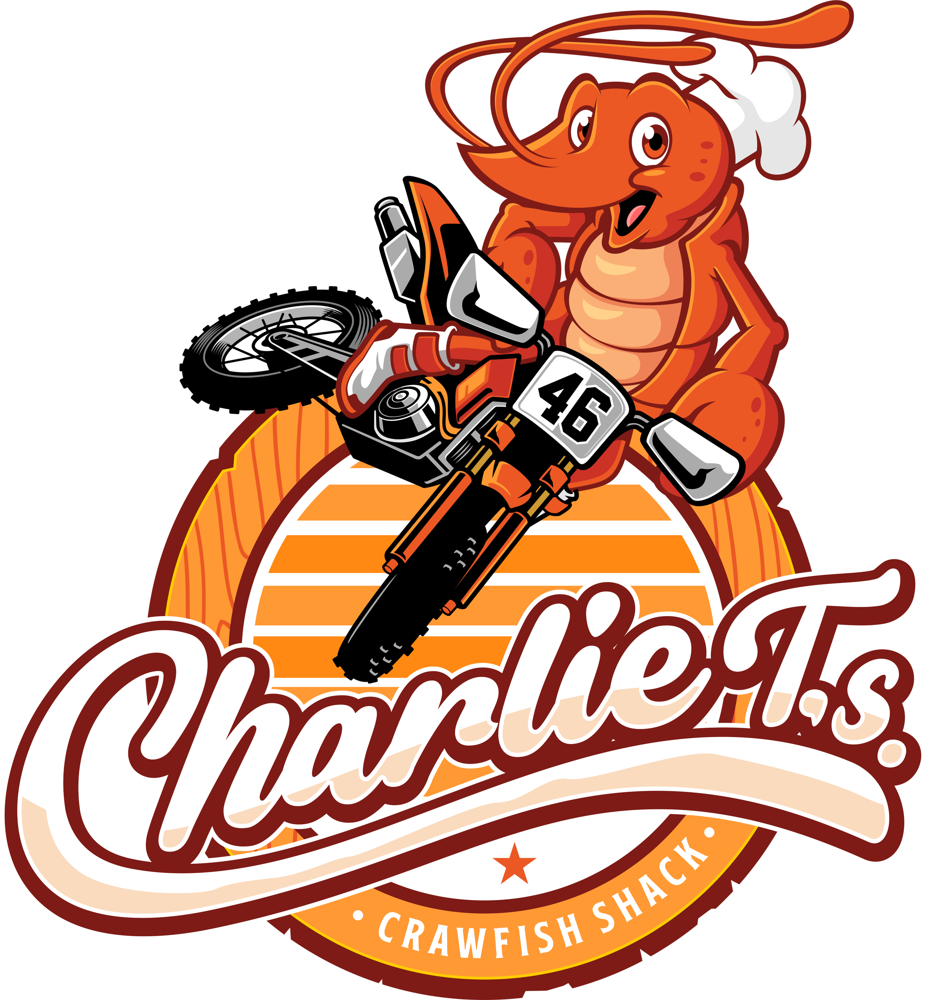
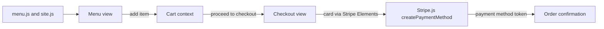

<p align="center">
  
</p>

<h1 align="center">Charlie T's Crawfish Shack</h1>

<p align="center">
  <b>Fresh boiled crawfish and Cajun seafood in Dayton, Texas — order online for pickup.</b>
</p>
<p align="center">
  A static React storefront for <a href="https://charliets.com">charliets.com</a>: a six-section menu,<br />
  an in-browser cart, and a three-step Stripe Elements checkout — no backend to run.
</p>

<p align="center">
  
  
  
  
  
  
</p>

<br />

## Why Charlie T's

A crawfish shack does not need a server farm. This is the entire front end for charliets.com — a single-page React app that runs on Vercel with nothing behind it. The menu, hours, address, and social links live in two data files; the cart lives in browser memory; the contact form opens the visitor's own email client. Guests browse the menu, fill a cart, and walk through a Stripe Elements checkout for pickup, all client-side.

<table width="100%">
  <tr>
    <td width="33%" valign="top">
      <h3 align="center">Front end only</h3>
      <p align="center">A static React SPA on Vercel — no backend, no database. The cart lives in memory and the contact form is a plain <code>mailto:</code>.</p>
    </td>
    <td width="33%" valign="top">
      <h3 align="center">Order for pickup</h3>
      <p align="center">A six-section menu feeds a cart drawer and a three-step Stripe Elements checkout — contact, pickup time, then card.</p>
    </td>
    <td width="33%" valign="top">
      <h3 align="center">Content as data</h3>
      <p align="center">Menu items, prices, hours, address, and social links all sit in <code>menu.js</code> and <code>site.js</code> — most edits are data, not markup.</p>
    </td>
  </tr>
</table>

<br />

## Stack

| Layer      | Choice                                                                                  |
| :--------- | :-------------------------------------------------------------------------------------- |
| Framework  | React 19 + React Router 7                                                                |
| Build      | Create React App (`react-scripts` 5) via **react-app-rewired** (`config-overrides.js`)  |
| Styling    | Tailwind CSS 3 + PostCSS + Autoprefixer                                                  |
| Payments   | Stripe Elements — `@stripe/react-stripe-js` + `@stripe/stripe-js`                        |
| Cart state | In-memory React context + reducer (not persisted)                                       |
| Hosting    | Vercel                                                                                   |

Not a Vite project — the build runs through **react-app-rewired**, whose `config-overrides.js` swaps in browser polyfills for Node core modules (e.g. `path-browserify`).

## Getting started

```bash
npm install
npm start          # react-app-rewired dev server on localhost:3000
npm run build      # production build — what Vercel runs
npm test           # react-app-rewired test runner
npm run lint       # eslint src/
npm run format     # prettier --write "src/**/*.{js,jsx,css}"
```

`npm run build` pins `CI=false` (via `cross-env`), so lint warnings don't fail the Vercel deploy. To reproduce Create React App's strict "warnings are errors" gate before pushing, run `CI=true npx react-app-rewired build`.

Stripe card entry needs a publishable key — set one to exercise real checkout locally:

```bash
# .env.local
REACT_APP_STRIPE_PUBLIC_KEY=pk_test_xxx
```

## Routes

| Route            | What it is                                                                                |
| :--------------- | :---------------------------------------------------------------------------------------- |
| `/`              | Home — hero, what-we-do, how-it-works, menu highlights, testimonials, catering, location  |
| `/menu`          | Full six-section menu with add-to-cart; market-price items switch to a "Call to order" link |
| `/about`         | Charlie's story — timeline, values, sourcing                                              |
| `/contact`       | Address, hours, embedded map, catering details, mailto contact form, FAQ                  |
| `/checkout`      | Cart summary + three-step Stripe Elements form (pickup only)                              |
| `/order-success` | Order confirmation with pickup details                                                    |
| `*`              | 404 fallback                                                                              |

## Menu

Six sections, all defined in `src/app/constants/menu.js` (prices in cents):

- **The Boil** — crawfish, head-on Gulf shrimp, snow crab, blue crab, the Charlie T Combo, and fixins
- **Starters** — boudin balls, fried pickles, peel & eat shrimp, crawfish dip, hushpuppies
- **Plates** — fried/blackened catfish, fried shrimp, crawfish etouffee, gumbo, red beans & rice
- **Sandwiches** — shrimp, catfish, roast beef, and hot sausage po'boys
- **Sides** — Cajun fries, slaw, collard greens, corn, dirty rice, mac & cheese
- **Drinks** — sweet/unsweet tea, lemonade, and sodas

Whole Boiled Crawfish is market-price (`marketPrice: true`) and seasonal — January through June, minimum 3 lbs — so it shows a "Call to order" link instead of an add-to-cart button.

## How it works

- **Content is data.** Menu items, prices, hours, address, and social handles live in `src/app/constants/menu.js` and `site.js`; views render them, so most updates are one-line data edits.
- **The cart is in memory.** `CartContext` is a React context + reducer with no persistence — it resets on refresh, and no order data leaves the browser.
- **Checkout is three steps.** `CheckoutView` collects contact info, then a pickup time (ASAP · 45 min · 1 hour), then a Stripe `CardElement`; 8.25% tax is added at checkout.
- **The card is tokenized, not charged.** On submit the app calls `stripe.createPaymentMethod` and routes to `/order-success`. With no backend there is no PaymentIntent, so no real charge is captured — that would need a server-side Stripe step this front end does not include.



## Project structure

```
src/
  index.js               app entry — BrowserRouter + ErrorBoundary
  app/
    App.js               route table
    components/
      common/            Header, Footer, CartDrawer, ScrollToTop
      ui/                Button, Eyebrow, Marquee, NumberPlate, StarRating, …
    context/             CartContext — in-memory cart (context + reducer)
    constants/           menu.js, site.js — all site content
    utils/               FormatUtility, ErrorBoundaryUtility
    index.css            Tailwind layers + custom textures
  views/                 home, menu, about, contact, checkout, not-found
public/                  logo.webp, index.html, manifest.json, release.json
config-overrides.js      react-app-rewired webpack overrides
tailwind.config.js       "Race Day at the Boil" design tokens
```

## License

Private project — all rights reserved. Made by [TaylorURL](https://taylorurl.com).

<br />

<p align="center">
  <sub>Seasoning heavy, napkins useless.</sub>
</p>
</content>
