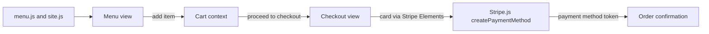

<p align="center">
  
</p>

<h1 align="center">Charlie T's Crawfish Shack</h1>

<p align="center">
  Front end for <a href="https://charliets.com">charliets.com</a> — fresh boiled crawfish and Cajun seafood in Dayton, Texas. <em>Seasoning heavy, napkins useless.</em>
</p>

<p align="center">
  
  
  
  
  
  
</p>

- **Front end only, no backend** — the whole site is a static React SPA on Vercel; the cart lives in memory and the contact form opens the visitor's own email client.
- **Order online for pickup** — a six-section menu feeds a cart drawer and a three-step Stripe Elements checkout: contact, pickup time, then card.
- **Content lives in two data files** — menu items, prices, hours, address, and social links all sit in `menu.js` and `site.js`, so most edits are data changes, not markup.

## Stack

| Layer | Choice |
|-------|--------|
| Framework | React 19 + React Router 7 |
| Build | Create React App (`react-scripts` 5) via **react-app-rewired** (`config-overrides.js`) |
| Styling | Tailwind CSS 3 + PostCSS + Autoprefixer |
| Payments | Stripe Elements — `@stripe/react-stripe-js` + `@stripe/stripe-js` |
| Cart state | In-memory React context + reducer (not persisted) |
| Hosting | Vercel |

Not a Vite project — the build runs through **react-app-rewired**, whose `config-overrides.js` swaps in browser polyfills for Node core modules (e.g. `path-browserify`).

## Getting started

```bash
npm install
npm start          # react-app-rewired dev server on localhost:3000
npm run build      # production build — what Vercel runs
npm test           # react-app-rewired test runner
npm run lint       # eslint src/
npm run format     # prettier --write
```

`npm run build` pins `CI=false` (via `cross-env`), so lint warnings don't fail the Vercel deploy. To reproduce Create React App's strict "warnings are errors" gate before pushing, run `CI=true npx react-app-rewired build`.

Stripe card entry needs a publishable key — set one to exercise real checkout locally:

```bash
# .env.local
REACT_APP_STRIPE_PUBLIC_KEY=pk_test_xxx
```

## Pages

| Route | What it is |
|-------|-----------|
| `/` | Home — hero, what-we-do, how-it-works, menu highlights, testimonials, catering, location |
| `/menu` | Full six-section menu with add-to-cart; market-price items switch to a "Call to order" link |
| `/about` | Charlie's story — timeline, values, sourcing |
| `/contact` | Address, hours, embedded map, catering details, mailto contact form, FAQ |
| `/checkout` | Cart summary + three-step Stripe Elements form (pickup only) |
| `/order-success` | Order confirmation with pickup details |
| `*` | 404 fallback |

## Menu

Six sections, all defined in `src/app/constants/menu.js` (prices in cents):

- **The Boil** — crawfish, head-on Gulf shrimp, snow crab, blue crab, the Charlie T Combo, and fixins
- **Starters** — boudin balls, fried pickles, peel & eat shrimp, crawfish dip, hushpuppies
- **Plates** — fried/blackened catfish, crawfish etouffee, gumbo, red beans & rice
- **Sandwiches** — shrimp, catfish, roast beef, and hot sausage po'boys
- **Sides** — Cajun fries, slaw, collard greens, dirty rice, mac & cheese
- **Drinks** — sweet/unsweet tea, lemonade, sodas, and Louisiana beer

Whole Boiled Crawfish is market-price and seasonal (January–June), so it shows a "Call to order" link instead of an add-to-cart button.

## Checkout

Checkout runs entirely in the browser with **Stripe Elements**, in three steps:

1. **Contact** — name, email, phone.
2. **Pickup** — ASAP / 45 min / 1 hour, plus optional notes.
3. **Payment** — a Stripe `CardElement`; on submit the app calls `stripe.createPaymentMethod` to tokenize the card, then routes to `/order-success`.

The publishable key comes from `REACT_APP_STRIPE_PUBLIC_KEY` (falling back to a `pk_test_placeholder`). There is **no backend**: the card is tokenized but not charged — capturing a real payment would need a server-side Stripe step (a PaymentIntent) that this front end does not include. Orders are pickup-only, with 8.25% tax added at checkout.

## How it fits together



Everything is per-browser and in-memory — the cart resets on refresh, and no order data leaves the client.

## Project structure

```
src/
  index.js               app entry — BrowserRouter + ErrorBoundary
  app/
    App.js               route table
    components/
      common/            Header, Footer, CartDrawer, ScrollToTop
      ui/                Button, Eyebrow, Marquee, NumberPlate, StarRating, …
    context/             CartContext — in-memory cart (context + reducer)
    constants/           menu.js, site.js — all site content
    utils/               FormatUtility, ErrorBoundaryUtility
    index.css            Tailwind layers + custom textures
  views/                 home, menu, about, contact, checkout, not-found
public/                  logo.webp, index.html, manifest.json, release.json
config-overrides.js      react-app-rewired webpack overrides
tailwind.config.js       "Race Day at the Boil" design tokens
```

## License

Private project — all rights reserved. Made by [TaylorURL](https://taylorurl.com).
