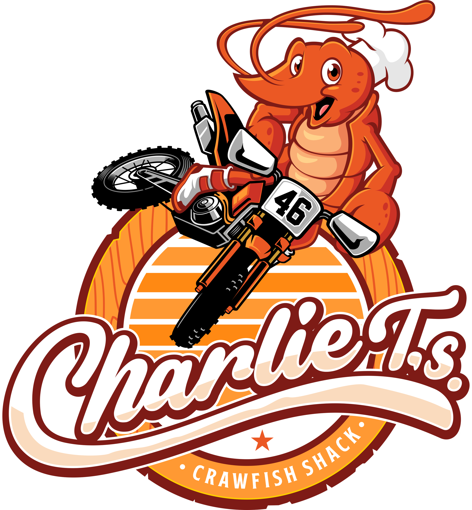
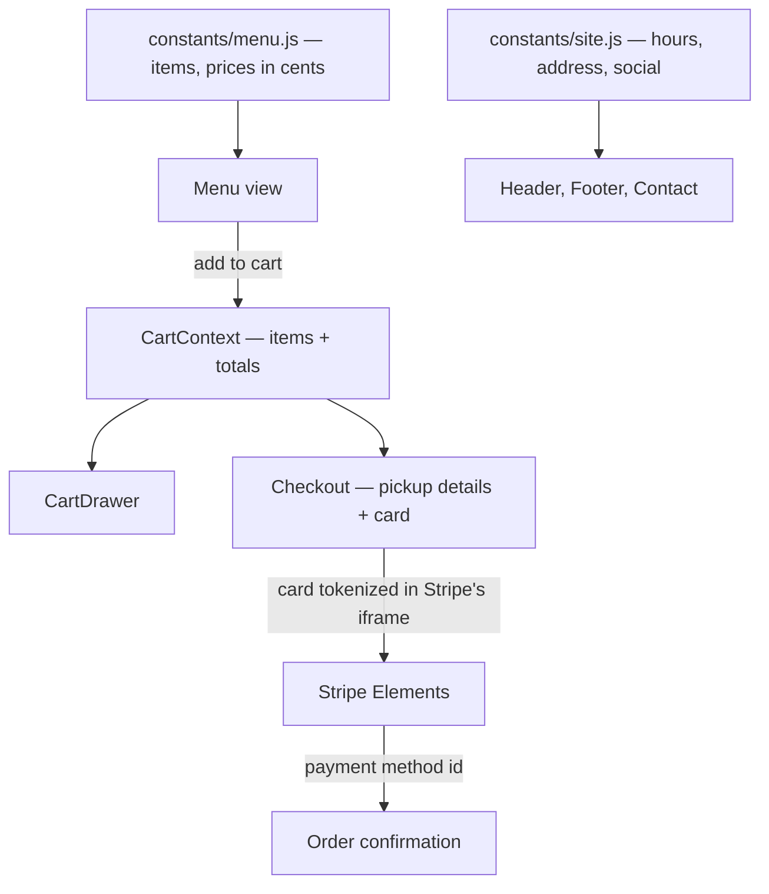

<p align="center">
  
</p>

<h1 align="center">Charlie T's Crawfish Shack</h1>

<p align="center">
  <b>Fresh boiled crawfish and Cajun seafood in Dayton, Texas.</b>
</p>
<p align="center">
  The restaurant site for Charlie T's — menu, story, and online pickup ordering.<br />
  Heavy seasoning, communal tables, no reservations.
</p>

<p align="center">
  
  
  
  
  
  
</p>

<br />

## Why Charlie T's

A seafood shack's site has one job: show what's in the pot today and let people order it without a phone call. Every price, hour, and address on this site comes from two constants files, so a menu change is one edit and never a hunt through JSX. The whole thing is a static React bundle — no CMS, no database, nothing to keep running.

<table width="100%">
  <tr>
    <td width="50%" valign="top">
      <h3 align="center">One source of truth</h3>
      <p align="center">Menu items, prices in cents, hours, address, and social handles live in <code>constants/menu.js</code> and <code>constants/site.js</code> — the views only render them.</p>
    </td>
    <td width="50%" valign="top">
      <h3 align="center">Market price, handled</h3>
      <p align="center">Items flagged <code>marketPrice</code> — crawfish by the pound — display their label but cannot be added to the cart, so the online order never quotes a price the kitchen has not set.</p>
    </td>
  </tr>
</table>

<br />

## Stack

| Layer | Technology |
| :--- | :--- |
| UI | React 19 + React Router 7 |
| Build & dev | Create React App 5 through `react-app-rewired` |
| Styling | Tailwind CSS 3 (custom `crawfish` / `ink` / `surface` palette) |
| Type | Anton (display), Permanent Marker (paint), DM Sans (body) |
| Cart state | React context (`CartContext`) |
| Payments | Stripe Elements (`@stripe/react-stripe-js`) |
| Media | Muted ambient background video with reduced-motion fallback |

## Getting started

```bash
npm install
npm start             # dev server on http://localhost:3000
npm run build         # production build to build/
```

The site runs with no configuration — Stripe falls back to a placeholder publishable key, and card entry stays in test mode until a real one is supplied.

| Variable | Purpose |
| :--- | :--- |
| `REACT_APP_STRIPE_PUBLIC_KEY` | Stripe publishable key for the checkout card element. Defaults to `pk_test_placeholder`. |

### Scripts

| Script | Does |
| :--- | :--- |
| `npm start` | Start the dev server. |
| `npm run build` | Production build (`CI=false`, so warnings don't fail it). |
| `npm test` | Run the CRA test runner (passes with no tests). |
| `npm run lint` | Lint `src/` with ESLint. |
| `npm run format` | Format `src/**` with Prettier. |

## Routes

| Path | View |
| :--- | :--- |
| `/` | Home — hero, ambient video, highlights |
| `/menu` | Full menu by category |
| `/about` | The shack's story |
| `/contact` | Hours, address, phone, catering |
| `/checkout` | Cart, pickup time, card entry |
| `/order-success` | Order confirmation |
| `*` | Not found |

## Architecture


```mermaid
flowchart TD
    M["constants/menu.js — items, prices in cents"] --> V["Menu view"]
    V -->|"add to cart"| C["CartContext — items + totals"]
    C --> D["CartDrawer"]
    C --> CO["Checkout — pickup details + card"]
    CO -->|"card tokenized in Stripe's iframe"| ST["Stripe Elements"]
    ST -->|"payment method id"| SU["Order confirmation"]
    S["constants/site.js — hours, address, social"] --> F["Header, Footer, Contact"]
```

## How it works

- **Prices are integers.** Everything in `menu.js` is stored in cents and formatted through `FormatUtility`, so no float rounding creeps into a total.
- **Tax is applied at checkout.** The order summary adds 8.25% Texas sales tax on top of the cart subtotal.
- **Pickup only.** Checkout collects a name, email, phone, notes, and a pickup window (ASAP, 45 minutes, or 1 hour) — there is no delivery or reservation flow.
- **Card details never touch the app.** The Stripe `CardElement` tokenizes the card in Stripe's iframe; the app only ever sees the resulting payment method id.
- **Ambient video is polite.** `AmbientVideo` autoplays muted inline, pauses itself when scrolled out of view, and swaps to a poster image when the visitor prefers reduced motion.
- **The look is dirt-track, not tablecloth.** Checkered bands, number plates, hazard stripes, and crossed flags are generated from Tailwind `backgroundImage` gradients in `components/ui`, so there are no decorative image assets to ship.

> **Pre-launch note.** Checkout currently creates a Stripe payment method and forwards the order to the confirmation view — no server-side charge is captured yet. The phone number and social handles in `constants/site.js` are still placeholders and need swapping before launch.

## Project structure

```
charliets-com/
├── public/
│   ├── index.html             Meta, Open Graph, LocalBusiness JSON-LD
│   ├── logo.webp              Logo / PWA icon
│   ├── manifest.json          PWA manifest
│   └── video/                 Ambient clip + poster
├── config-overrides.js        CRA webpack fallbacks (react-app-rewired)
├── tailwind.config.js         Palette, display/body fonts, motion tokens
└── src/
    ├── app/
    │   ├── App.js             Route table + layout shell
    │   ├── components/common/ Header, Footer, CartDrawer, AmbientVideo, ScrollToTop
    │   ├── components/ui/     Button, Eyebrow, Marquee, NumberPlate, CheckeredBand, …
    │   ├── constants/         menu.js (items, prices), site.js (hours, address, social)
    │   ├── context/           CartContext — cart state and totals
    │   ├── utils/             Currency formatting, error boundary
    │   └── index.css          Tailwind entry
    ├── views/                 home, menu, about, contact, checkout, not-found
    └── index.js               Browser entry
```

## License

Copyright (c) 2026 Trenton Taylor. All rights reserved.

<br />

<p align="center">
  <sub>Built by <a href="https://taylorurl.com">TaylorURL</a> — custom sites for local businesses.</sub>
</p>
